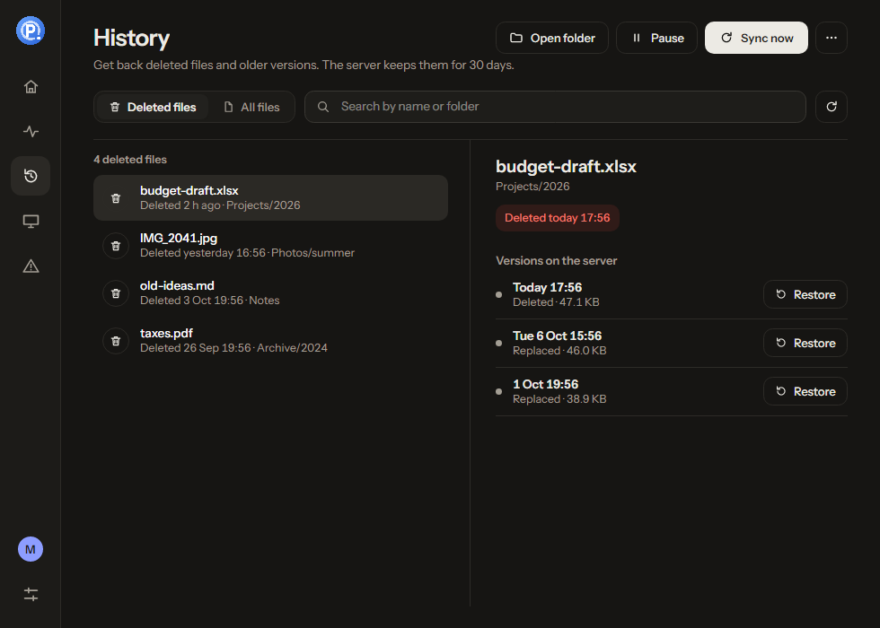

# Pairnets

Pairnets keeps **one folder identical on your computers** (built for two Windows PCs, also available
for Mac and Linux desktops) that you use one at a time, through a
small server you own, reached from anywhere through a **Cloudflare Tunnel** on your own domain.
No ports to open, no cloud storage, no telemetry.

> **Pairnets used to be called Tether.** Installing Pairnets takes over a Tether server and Tether
> apps with everything they had (files, history, token, settings). Tether apps can't update
> themselves into Pairnets, so install it by hand once: [Moving from Tether to Pairnets](docs/HOWTO.md#moving-from-tether-to-pairnets).

* Work on the desktop: changes flow to the server within seconds.
* Switch to the laptop: it catches up on start (new files, edits and deletions), then keeps syncing.
* Go back to the desktop: it picks up what you did on the laptop. Forever.

Data safety comes first. Pairnets never silently overwrites a file: when both PCs changed the same
file it keeps both. Every overwritten or deleted file stays on the server for 30 days. It refuses
to act when something looks wrong (wrong folder, unplugged drive, many deletions at once).

```
   Desktop PC                                  Ubuntu server (at home)                              Laptop PC
 ┌───────────────┐  HTTPS through Cloudflare   ┌──────────────────────┐  HTTPS through Cloudflare   ┌───────────────┐
 │ Pairnets tray │ ──────── + token ─────────▶ │ pairnets-server      │ ◀──────── + token ───────── │ Pairnets tray │
 │  D:\Work      │ ◀───── push "Changed" ───── │  files/  history/    │ ───── push "Changed" ─────▶ │  D:\Work      │
 └───────────────┘                             │  manifest.db         │                             └───────────────┘
                                               └──────────────────────┘
```

**New here? Start with the step-by-step guide: [How to install Pairnets, and how it works](docs/HOWTO.md).**
Or let Claude do it: copy a ready-made prompt from [Set Pairnets up with Claude](docs/SETUP-WITH-CLAUDE.md).

<p>
  
  
</p>

| Install on | How |
|-----------|-----|
| **Ubuntu server** | `curl -fsSL https://raw.githubusercontent.com/MRnigth/Pairnets/main/deploy/get.sh \| sudo bash -s -- --public-url https://sync.example.com` |
| **Windows** | **[Download PairnetsSetup.exe](https://github.com/MRnigth/Pairnets/releases/download/latest/PairnetsSetup.exe)** (installer) or [pairnets-client-win-x64.zip](https://github.com/MRnigth/Pairnets/releases/download/latest/pairnets-client-win-x64.zip) (just `Pairnets.exe`) |
| **macOS** | [Pairnets-macos-arm64.dmg](https://github.com/MRnigth/Pairnets/releases/download/latest/Pairnets-macos-arm64.dmg) (Apple Silicon) / [Pairnets-macos-x64.dmg](https://github.com/MRnigth/Pairnets/releases/download/latest/Pairnets-macos-x64.dmg) (Intel), or `curl -fsSL https://raw.githubusercontent.com/MRnigth/Pairnets/main/deploy/get.sh \| bash -s -- --mac` |
| **Linux desktop** | [pairnets-desktop-linux-x64.tar.gz](https://github.com/MRnigth/Pairnets/releases/download/latest/pairnets-desktop-linux-x64.tar.gz) or `curl -fsSL https://raw.githubusercontent.com/MRnigth/Pairnets/main/deploy/get.sh \| bash -s -- --desktop` |

More detail: [Architecture](docs/ARCHITECTURE.md) · [Deploy](docs/DEPLOY.md) ·
[Security](docs/SECURITY.md) · [Testing](docs/TESTING.md) · [Decisions](docs/DECISIONS.md)

Contributing or picking up the project? Start with the [developer handbook](docs/dev/README.md)
(current status, branch map, how it was built) and the [changelog](CHANGELOG.md).

## Quick start

### Server (once)

1. In the Cloudflare dashboard create a tunnel (Zero Trust → Networks → Tunnels → *Cloudflared*),
   copy its token, and give it a public hostname such as `sync.example.com` pointing at
   `HTTP localhost:5075`. Turn off Bot Fight Mode for the domain.
2. On the Ubuntu machine:

   ```bash
   curl -fsSL https://raw.githubusercontent.com/MRnigth/Pairnets/main/deploy/get.sh | sudo bash -s -- --public-url https://sync.example.com
   ```

It asks for the tunnel token and prints the **server URL** (`https://sync.example.com/`) and a
**token**. Save the token in your password manager; it is shown only once. Step by step, and what
Cloudflare can see: [HOWTO sections 2 to 4](docs/HOWTO.md#2-create-a-cloudflare-tunnel).

### Each PC

1. Download `pairnets-client-win-x64.zip` from the [releases](https://github.com/MRnigth/Pairnets/releases)
   and extract `Pairnets.exe` to a permanent place, for example `%LocalAppData%\Programs\Pairnets`.
2. Run it. In the setup window enter the server URL and token, choose the folder (for example
   `D:\Work`), keep the device name (each PC must have its own), press **Test connection**, then
   **Start syncing**.
3. Optional: tick **Start with Windows**.

Pairnets has a window with a sidebar: **Overview** (status, a picture of this computer, the server
and your other computer with files moving between them, the current transfer, facts and recent
activity), **Activity** (by day), **History** (get back deleted files and older versions with one
click), **Devices**, **Needs attention** and **Settings**. Its icon sits in the notification area (Windows), menu
bar (Mac) or system tray (Linux); clicking it opens a small quick panel with the same status at a
glance. The icon is green when up to date, blue while syncing, grey when offline, orange when it
needs your decision, red on errors, and yellow when paused. Closing the window keeps Pairnets syncing
in the background.

## How it works, in plain words

* **Hashes, not dates, decide.** For each file Pairnets compares what you have, what the server has,
  and what both agreed on last time. If only one side changed, that change is copied. If both
  changed, both versions are kept.
* **Conflicts.** If both PCs edited the same file, the server version keeps the name and your
  version is saved next to it as `report (conflict LAPTOP 2026-10-02 141509).docx`. The copy
  reaches the other PC too. A notification tells you. Open both, keep what you want, delete the
  other.
* **Deletions.** Deleting a file on one PC deletes it on the other (into the Recycle Bin). If you
  *edited* a file on one PC while it was deleted on the other, the edit wins and the file comes back.
* **History.** The server keeps every overwritten and deleted version for 30 days (and always the
  last 5 per file). To get one back, open **History** in the Pairnets window, pick the file and click
  **Restore** (or use the maintenance commands in [DEPLOY.md](docs/DEPLOY.md#4-maintenance-commands)).
* **Safety stops.** Pairnets pauses and asks before:
  * deleting more than 20 % of your files (or more than 50) in one go;
  * syncing a folder that is suddenly empty or missing its hidden `.pairnets-marker` file (an
    unplugged drive or a wrong path must not look like "I deleted everything");
  * syncing with a server that was replaced or restored from a backup.
* **Not synced:** empty folders (folders are created as needed), file permissions, temporary and
  lock files (`~$*`, `*.tmp`, `*.part`, `Thumbs.db`, `desktop.ini`, `.git/` …, plus your own
  patterns in Settings), symlinks and junctions. A rename is synced as delete + create.

## Troubleshooting

| You see | What to do |
|---------|-----------|
| Grey icon, "Offline" | The PC cannot reach the server. Check that the computer is online and that `sudo systemctl status pairnets-server pairnets-tunnel` shows both active. Pairnets retries by itself. Nothing is lost: local changes sync when it is back. |
| "Cloudflare cannot reach your Pairnets server" / "blocked Pairnets with a browser check" | See [HOWTO section 4](docs/HOWTO.md#4-check-it-from-outside): the tunnel is down, or Bot Fight Mode is on for your domain. |
| "The server rejected the token" | The token in Settings does not match `/etc/pairnets/pairnets.env` (it was rotated, or mistyped). Enter it again in **Settings**. Read it on the server with `sudo grep SYNC_TOKEN /etc/pairnets/pairnets.env`. |
| "Deletions blocked" | A sync would delete many files. Right-click → **Allow these deletions…** shows exactly which ones. If that is not what you did, press No and check the folder; files are still on the server and in its history. |
| "Folder is missing" / "no .pairnets-marker" | The drive is unplugged or the folder moved. Plug it in and **Sync now**, or use **Locate the sync folder…** to point Pairnets at its new location. |
| "The server went back in time" / "not the one this folder was synced with" | The server was restored from a backup or reinstalled. Use **Re-link to this server…**: it merges without deleting or overwriting. |
| A file named `… (conflict PC date time) …` appeared | Both PCs changed that file. Compare the two, keep the right content under the original name, delete the conflict copy. |
| "Name collision" / "File name not allowed" | Two names differ only in letter case (`Report.txt` vs `report.txt`), a file and a folder have the same name, or a name is not valid on Windows (for example `CON.txt` or a trailing dot). Rename it; the **Needs attention** page lists them. |
| Anything else | Right-click → **View log** (kept 14 days in `%LocalAppData%\Pairnets\logs`). Server: `sudo journalctl -u pairnets-server`. Logs never contain your token. |

## Building from source

```bash
dotnet build            # .NET 8 SDK; the Windows client builds on Linux too (EnableWindowsTargeting)
dotnet test             # unit, integration, fault-injection and convergence tests
dotnet publish src/Pairnets.Server -c Release -r linux-x64 --self-contained -p:PublishSingleFile=true -o publish/server
dotnet publish src/Pairnets.Client -c Release -r win-x64  --self-contained -p:PublishSingleFile=true -p:IncludeNativeLibrariesForSelfExtract=true -o publish/client
```

Releases are built by `.github/workflows/release.yml` when a `v*` tag is pushed.

## Roadmap (not in v1)

These are intentionally left out of v1. The code is structured so they can be added without a
rewrite:

* syncing empty folders
* file permissions and ACLs
* rename and move detection (today: delete + create)
* delta transfers, and resumable downloads (big uploads already go in resumable pieces;
  the download endpoint already supports HTTP Range)
* more than two PCs used at the same time
* end-to-end encryption at rest on the server
* a web UI and mobile apps

## License

MIT, see [LICENSE](LICENSE).
