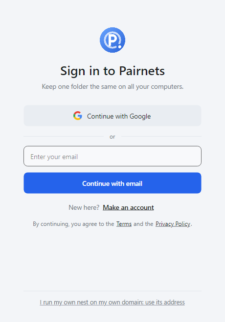
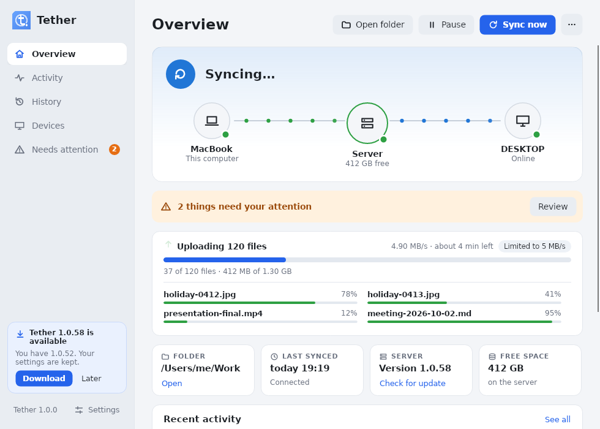
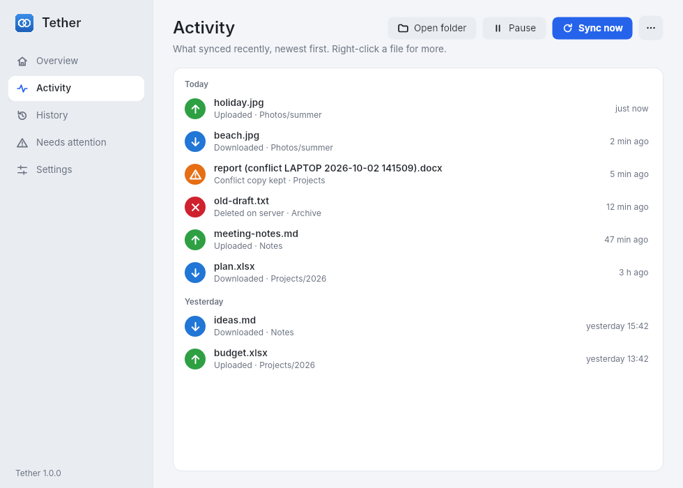
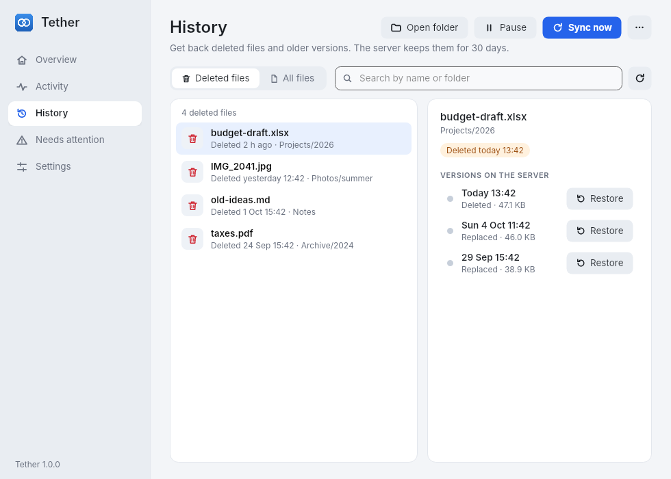
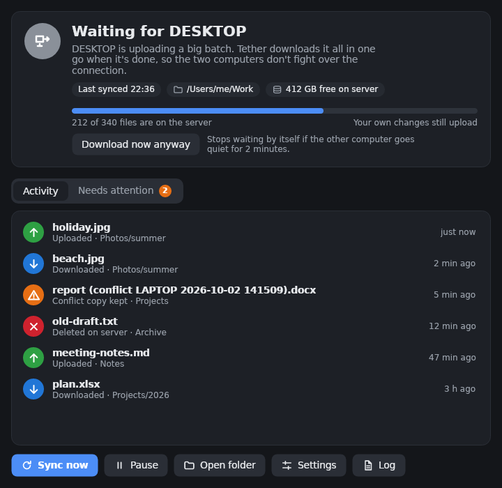
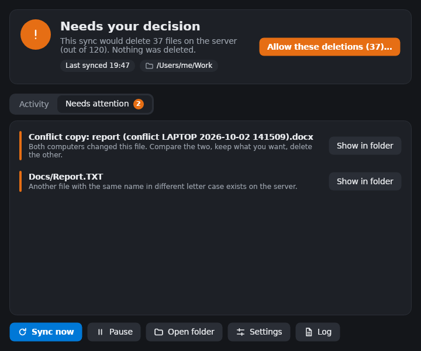
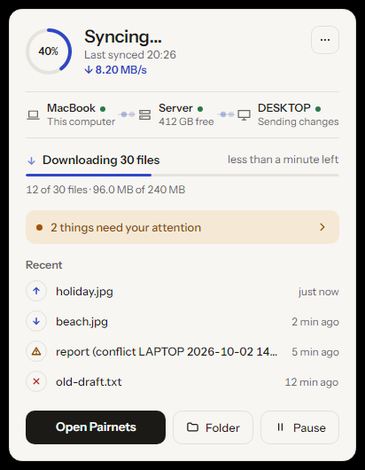
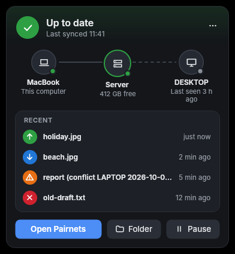
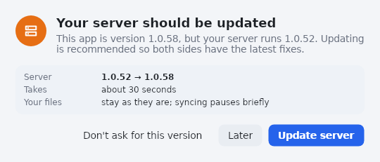

# How to install Pairnets, and how it works

This guide takes you from nothing to two PCs that keep one folder in sync, step by step. It then
explains in plain language what Pairnets does and what to do when something needs your attention.
Allow about 30 minutes.

> Prefer to have it done for you? [Set Pairnets up with Claude](SETUP-WITH-CLAUDE.md) has two
> copy-and-paste prompts: one for the server and one for each computer.

> Coming from **Tether** (Pairnets' old name)? See [Moving from Tether to Pairnets](#moving-from-tether-to-pairnets):
> installing Pairnets takes over everything; each computer then signs in once.

**Contents**

1. [What you need](#1-what-you-need)
2. [Choose your nest's name](#2-choose-your-nests-name)
3. [Install the server](#3-install-the-server)
4. [Check it from outside](#4-check-it-from-outside)
5. [Set up the first PC](#5-set-up-the-first-computer-for-example-the-desktop)
6. [Set up the second PC](#6-set-up-the-second-computer-for-example-the-laptop)
7. [Everyday use](#7-everyday-use)
8. [How it works](#8-how-it-works)
9. [When something needs your attention](#9-when-something-needs-your-attention)
10. [Updating and uninstalling](#10-updating-and-uninstalling)

---

## 1. What you need

| | |
|---|---|
| **A server** | Any always-on Ubuntu machine (22.04 or newer): a mini PC, an old laptop, a Raspberry Pi-class x64 box or a VM. It needs enough disk for your folder **plus history** (old versions are kept 30 days). Rule of thumb: twice the size of your folder. |
| **Your computers** | Windows 10/11 (64-bit), macOS 11 or newer (Apple Silicon or Intel), or a Linux desktop (64-bit, e.g. Ubuntu). Pairnets is built for using one at a time. |
| **A name for your nest** | Nothing to buy: Pairnets gives your server a free name such as `https://alice.pairnets.app`, with its own Cloudflare Tunnel, after a code sent to your email. Your computers reach the server at that address from anywhere, and no ports are opened on any router. Or, if you prefer, use a domain of your own on a free Cloudflare account (see [Advanced](#advanced-your-own-domain-and-tunnel)). |
| **The Pairnets release** | From <https://github.com/MRnigth/Pairnets/releases/latest>, or let the one-line commands below fetch it for you. |

Nothing else: no cloud storage, no extra accounts, no .NET installation.

---

## 2. Choose your nest's name

The server never accepts connections from the internet itself. It keeps one outgoing connection
open to Cloudflare (a *tunnel*), and Cloudflare passes your computers' requests for your nest's
name, for example `https://alice.pairnets.app`, through it. That is why nothing has to be opened on
any router, at home or wherever your computers are.

**Good to know first**

* **Cloudflare can see the traffic.** It decrypts HTTPS at its edge before passing requests through
  the tunnel, so in principle Cloudflare could see your computers' keys and your files. With a free
  name, the same goes for Pairnets, which runs the Cloudflare account the name and its tunnel live
  in. Your files are only ever stored on your own server. See [SECURITY.md](SECURITY.md).
* The address is reachable from the internet. What keeps strangers out: each computer has its own
  long key, and a computer only gets one when you press **Allow** on your nest's website, which only
  you can sign in to (with a passkey or password).
* Cloudflare's free plan refuses any single upload over 100 MB. Pairnets sends big files in pieces
  automatically: between 4 and 50 MB each, sized so one piece takes about 30 seconds on your
  connection (smaller on a slow or busy network) and halved after a dropped connection, so a bad
  connection loses little. An interrupted upload continues where it stopped. There is nothing to
  set.

### A free name (the easy way)

Pick a name: 3 to 32 letters, digits or hyphens, like `alice` or `smith-family`. Your nest becomes
`https://alice.pairnets.app`. You claim it in the next section, with the install command: it asks
for your email address and for the 6-digit code the Pairnets name service sends to it. That is all;
skip to [section 3](#3-install-the-server).

* One email address has one name, and the code works once, for 15 minutes.
* The name comes with its **own** Cloudflare Tunnel; no one else's server can receive its traffic.
* The installer keeps the name's **key** in `/etc/pairnets/name.env`, readable by root only. It is
  what lets you get a new tunnel token or give the name back later
  ([Your free name](#your-free-name)). Keep a copy, for example in your password manager.
* Some names are kept back (like `www`, `mail` or anything with `pairnets` in it), and a name that
  is taken is taken. Names used for abuse can be taken back; report abuse to support@pairnets.app.

### Advanced: your own domain and tunnel

If you have a domain on Cloudflare (a free account is enough: <https://dash.cloudflare.com>; a
domain costs about $10 to $15 a year), you can make the tunnel yourself and use an address on your
own domain, such as `https://sync.example.com`. Then Pairnets' name service is not involved at all.

**In the Cloudflare dashboard:**

1. Sign in at <https://dash.cloudflare.com> and check that your domain is listed.
2. Open **Zero Trust** → **Networks** → **Tunnels** → **Create a tunnel**, choose **Cloudflared**,
   and name it `pairnets`.
3. On the "Install and run a connector" page, pick **Debian** and copy the command shown
   (`sudo cloudflared service install eyJ…`). **Do not run it**: Pairnets' installer does that part
   in a safer way. The long text starting with `eyJ` is the **tunnel token**; treat it like a
   password.
4. Go on to **Public hostnames** and add one: subdomain `sync`, your domain, service **Type**
   `HTTP`, **URL** `localhost:5075`. Save. This guide calls the result **`https://sync.example.com`**.
5. For your domain, open **Security** → **Bots** and make sure **Bot Fight Mode** is off. It
   answers with browser checks that the Pairnets app cannot pass.

(Cloudflare moves its menus now and then. If something looks different, look for "Tunnels" under
Zero Trust → Networks.)

---

## 3. Install the server

**The quick way: one command.** On the Ubuntu server, with the name you picked:

```bash
curl -fsSL https://raw.githubusercontent.com/MRnigth/Pairnets/main/deploy/get.sh | sudo bash -s -- --name alice
```

It downloads the latest release, checks its SHA-256 checksum (it refuses a damaged or altered
download), and runs `install.sh`, which is described below. It asks for your email address (or add
`--email you@example.com`), then for the 6-digit code that arrives there (look in the spam folder
too). A wrong code can be typed again. When the code is right, the name and its tunnel exist and
the install carries on by itself.

With your own domain (from [Advanced](#advanced-your-own-domain-and-tunnel)), give your address
instead of a name:

```bash
curl -fsSL https://raw.githubusercontent.com/MRnigth/Pairnets/main/deploy/get.sh | sudo bash -s -- --public-url https://sync.example.com
```

That asks you to paste the tunnel token (pasting the whole copied command works too; nothing is
shown while you paste).

**Or step by step**, if you prefer to see each file:

```bash
# 1. Download the server package and its checksums
cd ~
curl -LO https://github.com/MRnigth/Pairnets/releases/latest/download/pairnets-server-linux-x64.tar.gz
curl -LO https://github.com/MRnigth/Pairnets/releases/latest/download/SHA256SUMS.txt

# 2. Check the download is intact (must print "pairnets-server-linux-x64.tar.gz: OK")
sha256sum --check --ignore-missing SHA256SUMS.txt

# 3. Unpack and install
tar xzf pairnets-server-linux-x64.tar.gz
cd pairnets-server-linux-x64
sudo ./install.sh --name alice      # or, with your own domain: --public-url https://sync.example.com
```

`install.sh` does everything for you:

* with `--name`, claims the free name from the Pairnets name service (the emailed code) and gets its
  tunnel token, keeping the name's key in `/etc/pairnets/name.env` (readable by root only);
* makes the server listen **only** on `127.0.0.1` (port 5075), so nothing on your network can
  reach it directly;
* installs `cloudflared` from Cloudflare's own package repository, keeps the tunnel token in
  `/etc/pairnets/tunnel.env` (readable by root only) and starts the background service
  `pairnets-tunnel`;
* creates a dedicated system user `pairnets` and the folders
  `/opt/pairnets` (program), `/var/lib/pairnets` (your data) and `/etc/pairnets` (settings);
* remembers your nest's name (`alice.pairnets.app`, or the `--public-url`), which turns on the
  nest's website;
* makes the old shared **token**, which only older Pairnets apps use (new apps sign in instead);
* installs and starts the background service `pairnets-server`; both services also start at boot.

At the end it checks that `https://alice.pairnets.app/api/health` answers, and prints a **one-time
setup link** for your nest's website (it looks like `https://alice.pairnets.app/setup#code=…`) with the
next steps. If the server itself does not start, it stops with an error and says where to look.

Check that both services are running:

```bash
sudo systemctl status pairnets-server pairnets-tunnel    # both should say "active (running)"
```

### Set up your nest's website (once)

Your nest has a small website on its own name. That is where you let computers in, see them and
remove them. Set it up now:

1. Open the setup link from the installer in a browser, on any computer. It works once, within
   24 hours.
2. Choose how you will sign in: **Add a passkey** (Windows Hello, Face ID, Touch ID, your phone or a
   security key; recommended) or **Choose a password** of at least 10 characters. You can add the
   other one later.
3. You land on the **Devices** page. It stays empty until your first computer signs in.

Lost the link, or later lost every way to sign in? On the server, run this and open the new link it
prints:

```bash
sudo -u pairnets /opt/pairnets/pairnets-server owner-link
```

Later, on the website's **Security** page, you can change the password, add passkeys, see where you
are signed in, switch off the old shared token, and turn on sign-in by email link or with Google
(both need a few settings on the server first, see [DEPLOY.md](DEPLOY.md#email-sign-in-links-optional)).

---

## 4. Check it from outside

Open `https://alice.pairnets.app/api/health` (or your own address) in a browser on any computer: it
should show `ok`. `https://alice.pairnets.app` itself should open your nest's sign-in page (or its
setup page, if you have not used the setup link yet). Then go on with
[section 5](#5-set-up-the-first-computer-for-example-the-desktop).

**If the app cannot connect**

| You see | What to do |
|---------|-----------|
| "Cloudflare cannot reach your Pairnets server (error 530)" (or 502) | On the server: `sudo systemctl status pairnets-tunnel` and `sudo journalctl -u pairnets-tunnel -n 50`. With a free name there is no dashboard to check; if the log says the token is not valid, get a new one with `sudo /opt/pairnets/pairnets-name.sh rotate`. With your own domain, the tunnel should say *Healthy* in the dashboard and its public hostname should point at `HTTP` `localhost:5075`. |
| "Cloudflare blocked Pairnets with a browser check" | Own domain: turn off Bot Fight Mode (Security → Bots), or add a WAF custom rule that skips it for your Pairnets hostname. Free name: write to support@pairnets.app. |
| "This server is reached through Cloudflare. Use https://" | In **Settings → Advanced**, type the address with `https://`, not `http://`. |
| "This nest has no website yet" | The server has no name of its own. Run the install command from section 3 with `--name alice` (or `--public-url https://sync.example.com`). |
| A login page instead of `ok` in the browser | Cloudflare Access is protecting the hostname. Remove the Access application for it: the Pairnets app cannot sign in through it. |

> **A server that was set up with Tailscale** (older versions)? Pairnets no longer uses Tailscale.
> Create the tunnel (section 2), then run the install command from section 3 on the server. It
> switches the server to the tunnel and keeps your files and history. Then sign each computer in
> with the nest's name (section 5); its folder and files stay as they are.

---

## 5. Set up the first computer (for example the desktop)

### Install

**Windows**: download one of these from the
[latest release](https://github.com/MRnigth/Pairnets/releases/latest):

* [`PairnetsSetup.exe`](https://github.com/MRnigth/Pairnets/releases/download/latest/PairnetsSetup.exe): the installer. It installs for your user only (no admin rights) and adds
  Pairnets to the Start menu.
* [`pairnets-client-win-x64.zip`](https://github.com/MRnigth/Pairnets/releases/download/latest/pairnets-client-win-x64.zip): extract `Pairnets.exe` to a permanent place, for example
  `%LocalAppData%\Programs\Pairnets\`.

Windows may say "Windows protected your PC" because the program is not code-signed. Click
**More info → Run anyway**.

**Mac**: either run this in *Terminal* (it picks the right version for Apple Silicon or Intel,
puts Pairnets in Applications and starts it):

```bash
curl -fsSL https://raw.githubusercontent.com/MRnigth/Pairnets/main/deploy/get.sh | bash -s -- --mac
```

or download `Pairnets-macos-arm64.dmg` (Apple Silicon: M1/M2/M3/M4) or `Pairnets-macos-x64.dmg`
(Intel) from the release, open it and drag **Pairnets** to **Applications**. The app is not
notarized by Apple, so the first time macOS refuses to open it. Open it once with
**right-click → Open → Open**. On macOS 15 and later, go to **System Settings → Privacy & Security**
and click **Open Anyway**. The Terminal command above avoids this. On a Mac, Pairnets lives in the
**menu bar** (top right), not the Dock.

**Linux desktop** (Ubuntu and similar, 64-bit): run as your normal user, without sudo:

```bash
curl -fsSL https://raw.githubusercontent.com/MRnigth/Pairnets/main/deploy/get.sh | bash -s -- --desktop
```

It installs into your home folder, adds Pairnets to the app menu and starts it. For the best
experience also run `sudo apt install libsecret-tools libnotify-bin`. Pairnets then keeps its
sign-in key in your keyring and can show notifications. On GNOME the tray icon needs the *AppIndicator*
extension, which Ubuntu enables by default.

### First-run setup: sign in

When Pairnets starts for the first time (or after **Reset**), the **sign-in** window opens. It looks
the same on Windows, Mac and Linux, and follows your system's light or dark mode:



1. Type your nest's name: the one the installer printed, in this guide `alice.pairnets.app` (or
   your own address, like `sync.example.com`). Pairnets checks that it is a Pairnets nest and shows
   which ways it offers.
2. Choose **Continue with Google**, or type your email and choose **Continue with email**, or
   choose **More ways to sign in in your browser** for a password or passkey (if your nest has no
   email or Google sign-in, the button just says **Sign in with your browser**). Your browser opens
   your nest's website and signs you in there.
3. Check that the code on the website matches the one in Pairnets and press **Allow**. The website
   sends you straight back to Pairnets.
4. Choose the folder to sync, for example `D:\Work` (it may already contain your files), and press
   **Start syncing**. Tick **Start Pairnets when I sign in to Windows** (on Mac and Linux: *when I log
   in*) so syncing starts automatically.

There is no first-run form for a server address and token any more: a computer only gets in when
you allow it on your nest. Your nest therefore needs its own public name first (see [section 3](#3-install-the-server)).
Extra ignore patterns, speed limits and the device name are on the **Settings** page afterwards.

The first sync uploads everything in the folder. A 20 GB folder takes a while; you can keep
working meanwhile.

### The Pairnets window

After setup the Pairnets window opens. A sidebar on the left switches between its pages:
**Overview**, **Activity**, **History**, **Devices**, **Needs attention** (the number shows how many)
and **Settings**. The buttons at the top right are always there: **Open folder**, **Pause**/**Resume**,
**Sync now**, and **⋯** for *View log* and *Report a bug*.



**Overview** shows everything at a glance:

* **Status card** (top): a coloured badge with a symbol (✓ up to date, ↻ syncing, ⏸ paused,
  ! needs a decision, ✕ error, crossed-out cloud for offline) and one line for the overall state.
  The top of the card takes on the status colour.
* **Your computers**: *this computer*, the *server* and your *other computer*, joined by lines. A
  green dot means online; for the other computer you see **Online**, **Sending changes**,
  **Uploading 340 files** or **Last seen 3 h ago**. While files move, dots travel along the
  lines: green towards the server (uploads), blue from the server (downloads). A dashed line means
  not connected. Hover a computer's name to see which app and version it runs. (An older server
  says *Update the server to see it*.)
* **"2 things need your attention"** with a **Review** button, when something waits for you.
* **Transfer card** (only while transferring; the arrow travels up while uploading and down while
  downloading, and the bars glide): how many files are being sent, the speed and the
  time left ("4.9 MB/s · about 4 min left"), one bar for the whole batch ("37 of 120 files · 412 MB
  of 1.30 GB"), and the files in progress right now, each with its own small bar. Pairnets sends up
  to four files at the same time. If new files appear while it syncs, the total grows straight away.
  "Limited to 5 MB/s" shows when you set a speed limit.
* **Facts**: the folder (with **Open**), when it last synced, the server's version (with **Check
  for update** or **Update server…**, orange when the server is older than the app) and the free
  space on the server (orange when less than 5 GB or 5 % is left).
* **Recent activity**: the last five changes; **See all** opens the Activity page.

**Activity** lists everything that happened recently, newest first, under *Today*, *Yesterday* and
so on: green ↑ uploaded, blue ↓ downloaded, red ✕ deleted, orange ⚠ conflict, red ! problem. Hover a
row for the exact time. Right-click a file for **Show in folder** or **Show versions…** (opens it in
History).



**History** gets back deleted files and older versions, straight from the server. **Deleted files**
lists what was deleted in the last 30 days; **All files** lists every file on the server, most
recently changed first. Type in the search box to find one by name or folder. Choose a file to see
the versions the server keeps (when each was replaced or deleted, and its size), then click
**Restore** next to the one you want. It becomes the current version again and reaches all your
computers within seconds; the version it replaces is kept in history too, so a restore can be undone.



**Devices** lists every computer that uses your server, online or when it was last seen, with its
system, Pairnets version and last change (see [Updates](#updates) for details).

**Needs attention** lists conflict copies and files that cannot be synced, each with a **Show in
folder** button, and the decision Pairnets is waiting for, if any.

**Settings** has your nest (with **Manage devices on the web**, **Sign out of this computer**, and
the server address and token under **Advanced**), the folder, this computer's name, ignore patterns,
**Updates and speed** and **Start over**. **Save** applies it at once.

**When an update is out**, a small card at the bottom of the sidebar says so, with **Update now**
(Windows) or **Download** (Mac and Linux). See [Updates](#updates) below.

**Waiting for the other computer.** When your other computer uploads a big batch (more than 100
files), this one waits and then downloads everything in one go instead of a few files at a time, so
the two don't fight over the connection. The status card shows how far the other computer is:



Your own changes still upload while it waits. It stops waiting by itself when the other computer is
done, goes quiet for 2 minutes, or after 30 minutes. **Download now anyway** stops waiting at once.

When Pairnets needs your decision (for example before deleting many files), the badge turns orange and
a button in the status card says what to do:



### The quick panel

Closing the window does **not** stop Pairnets. It keeps syncing in the background, with an icon:

* **Windows**: in the notification area next to the clock (click **^** if it is hidden). **Click**
  the icon for the quick panel, **double-click** it for the window, **right-click** it for the menu.
* **Mac**: in the menu bar at the top right of the screen. Click it for the menu; **Quick status…**
  opens the quick panel and **Open Pairnets** the window.
* **Linux**: in the system tray or top bar, depending on your desktop. Clicking the icon opens the
  quick panel on most desktops; the menu also has **Quick status…** and **Open Pairnets**.

The quick panel opens next to the icon and closes when you click elsewhere. It shows the status, your
computers, the transfer, the last four changes and what needs attention, with **Open Pairnets**,
**Folder** and **Pause** buttons, and **⋯** for Sync now, Settings, History, the log, Report a bug
and Exit.

<p>
  
  
</p>

The icon colour always shows the state:

| Icon | Meaning |
|------|---------|
| 🟢 green | up to date |
| 🔵 blue | syncing (hover to see which file and how far) |
| ⚪ grey | offline: cannot reach the server, retrying by itself |
| 🟠 orange | waiting for your decision (see section 9) |
| 🔴 red | an error, or some files need attention |
| 🟡 yellow | paused by you |

## 6. Set up the second computer (for example the laptop)

Install Pairnets the same way and sign in the same way: type your nest's name, check the code on
your nest's website and press **Allow**. While it waits, your other computers show a "wants to join"
notice that leads to the same page. Each computer gets its own key. Its name on the nest is the
computer's name (the nest adds " (2)" if another computer already has it; rename it in **Settings**
or on the nest). Then choose the folder you want on this computer.

* **Empty folder** (most common): Pairnets downloads everything from the server.
* **A folder that already holds a copy** (for example you copied it with a USB drive): Pairnets
  explains before starting that it will **merge**:
  * identical files are left alone (nothing is transferred);
  * files present on only one side are copied to the other;
  * files with the same name but different content are both kept (yours becomes a
    *conflict copy*, see below);
  * **nothing is deleted** on either side.

Click **OK** to continue. When the icon turns green on both PCs, you are done.

---

## 7. Everyday use

You do not have to do anything. Just work in the folder on whichever PC you are using.

* **While you work on the desktop**, every change (new file, edit, rename, delete) reaches the
  server about 2 seconds after you save.
* **When you switch to the laptop**, Pairnets catches up as soon as the laptop starts (or wakes
  from sleep): new files, edits and deletions from the desktop appear. If both PCs are on, a
  change on one shows up on the other within a few seconds.
* **When you go back to the desktop**, it picks up what you did on the laptop. And so on.
* **Offline?** Keep working. Pairnets retries by itself and syncs everything when the connection is
  back. It never loses local changes while offline.

> Good habit: before shutting down a PC, glance at the icon. Green means everything reached the
> server. Blue means wait a moment.

### The icon menu (right-click on Windows, click on Mac)

| Item | What it does |
|------|--------------|
| **Quick status…** (Mac and Linux) | opens the quick panel |
| **Open Pairnets** | opens the Pairnets window |
| **Sync now** | runs a complete check immediately |
| **Open folder** | opens the synced folder in Explorer, Finder or your file manager |
| **Allow these deletions (N)…** | only shown when Pairnets blocked a large deletion (see section 9) |
| **Locate the sync folder… / Confirm this folder… / Re-link to this server…** | only shown when Pairnets stopped to ask you something (see section 9) |
| **Settings…** | opens the window on the Settings page: your nest, folder, device name, ignore patterns |
| **View log** | opens today's log (kept 14 days in `%LocalAppData%\Pairnets\logs`) |
| **Report a bug…** | builds a report to send to whoever helps you (see [Updates](#updates)) |
| **Pause syncing / Resume syncing** | temporarily stop syncing on this PC |
| **Start with Windows / Start at login** | start Pairnets automatically when you sign in |
| **Exit / Quit Pairnets** | quit Pairnets. Nothing syncs until you start it again. |

---

## 8. How it works

### The big picture

```
     DESKTOP                         SERVER (Ubuntu)                        LAPTOP
  ┌────────────┐                  ┌───────────────────┐                 ┌────────────┐
  │  D:\Work   │  ── upload ───▶  │ files/   (latest) │  ── download ─▶ │  D:\Work   │
  │            │  ◀── download ── │ history/ (old and │  ◀── upload ──  │            │
  │  Pairnets  │                  │   deleted, 30 d)  │                 │  Pairnets  │
  └────────────┘   "something     │ manifest (list of │   "something    └────────────┘
                    changed" ◀──  │  every file)      │  ──▶ changed"
                                  └───────────────────┘
   all traffic goes over HTTPS through your Cloudflare Tunnel and needs each computer's own key
```

The two PCs never talk to each other directly. Each one only compares itself with the server.
The server is the meeting point and the safety net.

### Three fingerprints per file

For every file Pairnets computes a **fingerprint** of its content (a SHA-256 hash: two files have
the same fingerprint only if their bytes are identical). For each file it then looks at three
fingerprints:

* **Here**: the file on this PC now.
* **Server**: the file on the server now.
* **Last agreed**: what this PC and the server both had the last time this file was synced.

Comparing the three tells Pairnets exactly *who* changed the file, without trusting dates and
clocks:

| Situation | What Pairnets does |
|-----------|-------------------|
| Here = Server | nothing to do |
| Only **here** differs from "last agreed" | you changed it on this PC → **upload** |
| Only the **server** differs from "last agreed" | the other PC changed it → **download** |
| **Both** differ from "last agreed", and from each other | both PCs changed it → **conflict: keep both** |
| File deleted here, server unchanged | you deleted it → **delete it on the server** (kept in history) |
| File deleted on the server, unchanged here | the other PC deleted it → **move it to this PC's Recycle Bin** |
| Deleted on one side but **edited** on the other | the edit wins → the file comes back |

### Worked examples

**You edit `report.docx` on the desktop, then switch to the laptop.**
The desktop's "here" differs from "last agreed", so it uploads. The laptop sees that only the
server changed and downloads the new version. The old version is kept in the server's history.

**You edited `plan.xlsx` on the laptop while it was offline, and also on the desktop.**
When the laptop reconnects, both sides differ from "last agreed": a conflict. Pairnets does not
pick a winner. The server's version (the desktop's edit) keeps the name `plan.xlsx`, and the
laptop's version is saved next to it as

```
plan (conflict LAPTOP 2026-10-02 141509).xlsx
```

That copy is uploaded too, so both PCs end up with both files, and a notification tells you.
Open the two, combine or choose, and delete the one you no longer want.

**You delete `old-notes.txt` on the desktop.**
The server moves it into its history and the laptop moves its copy to the Recycle Bin. You can get
it back from either place for 30 days.

**You deleted a folder on the desktop, but on the laptop you had edited a file inside it.**
Edits beat deletions. The edited file is uploaded again, so it reappears on the desktop.

### How a change travels

1. You save a file. Windows tells Pairnets something changed; Pairnets waits about 2 seconds until the
   file is quiet (no half-written uploads).
2. Pairnets uploads it. The server stores it next to the previous version, which goes into
   `history/`, and records it in its list of files.
3. The server tells the other PC, if it is on, that something changed. It syncs within about a
   second. If it is off, it catches up the next time it starts.

Every few minutes Pairnets also does a full check anyway, in case Windows missed a change.

### Safety rules

Pairnets is built so that losing or silently overwriting your files should be impossible:

* **Nothing is overwritten blindly.** Every upload tells the server which version it is replacing.
  If the other PC changed the file in the meantime, the server refuses, and Pairnets makes a
  conflict copy instead.
* **Downloads are all-or-nothing.** A file is downloaded to a hidden `.pairnets-tmp` folder, checked,
  and only then swapped in. A broken connection never leaves a half-file behind.
* **Files still being written are left alone** (modified in the last 2 seconds, or locked by
  another program such as Word). Pairnets tries again shortly.
* **The server never really deletes anything.** Every replaced or deleted file goes to history:
  30 days, and always at least the last 5 versions of each file.
* **Big deletions need your OK.** If one sync would delete more than 20 % of your files, or more
  than 50 files, Pairnets stops and asks first. With few files in the folder, even one or two
  deletions can trigger this; that is deliberate.
* **The hidden `.pairnets-marker` file** in your folder proves it is the right folder. If it is
  missing, or the folder is suddenly empty (an unplugged drive, a wrong path), Pairnets stops and
  asks. It never reads that as "the user deleted everything".
* **A restored or replaced server is detected**, and Pairnets asks before syncing with it.

### What is not synced

* temporary and lock files: `~$*`, `*.tmp`, `*.temp`, `*.swp`, `*.part`, `*.crdownload`,
  `Thumbs.db`, `desktop.ini`, `.DS_Store`, `.git/` folders, plus your own extra patterns;
* empty folders (folders are created when a file needs them);
* shortcuts that are symbolic links or junctions;
* file permissions.

A renamed file is synced as "delete the old name, create the new name". The result is the same.

---

## 9. When something needs your attention

| You see | What it means and what to do |
|---------|------------------------------|
| **Grey icon, "Offline"** | This PC cannot reach the server. Check that the computer is online and the server is on. On the server: `sudo systemctl status pairnets-server pairnets-tunnel`. Pairnets keeps retrying; your changes are safe and sync when it is back. |
| **"Sign in to your nest"** | This computer still used the old shared token, and your nest now lets computers in only with their own key. Click **Sign in with your browser…**, check the code and press **Allow** on your nest. The folder, files and settings stay as they are. |
| **"Signed out of your nest"** | This computer was removed on your nest, the old shared token was switched off there, or you pressed **Sign out of this computer**. Its files are untouched. Click **Sign in again…** and allow it on your nest. |
| **"The server rejected the token"** | Only with an old server that has no name of its own: the token under **Settings → Advanced** is wrong, or was changed on the server. Paste the right one and click **Test connection**. |
| **"Deletions blocked"** (orange) | A sync would delete many files. Right-click → **Allow these deletions…** lists them, showing which PC loses what. If that is what you did, click **Yes** (it applies once). If not (wrong folder, unplugged drive), click **No** and investigate. Nothing has been deleted. |
| **"The folder is missing" / "no .pairnets-marker"** (orange) | The drive is unplugged, or you moved or renamed the folder. Plug the drive in and choose **Sync now**. If you moved the folder, choose **Locate the sync folder…** and point to its new place; Pairnets recognizes it by its marker and continues without resyncing. |
| **"This folder was already synced… Confirm"** | Pairnets finds a marker but no record of it on this PC (for example after reinstalling Windows). Choose **Confirm this folder…**. Pairnets then merges and deletes nothing. |
| **"The server went back in time" / "not the one this folder was synced with"** | The server was restored from a backup or reinstalled. Choose **Re-link to this server…**. Pairnets merges your folder with the server: nothing is deleted or overwritten, and differences become conflict copies. |
| **A file named `… (conflict PC date time) …`** | Both PCs changed the same file. Compare the two versions, keep what you want under the original name, and delete the conflict copy. |
| **"Name collision" / "File name not allowed"** | Two names differ only in upper/lower case (`Report.txt` and `report.txt`), a file and a folder share a name, or the name is not allowed on Windows. The **Needs attention** page lists them. Rename them and they sync. |

### Getting an old or deleted version back

Open the Pairnets window and choose **History** (see [The Pairnets window](#the-pairnets-window)): pick the
file under **Deleted files** or **All files**, then **Restore** the version you want. It becomes the
current version and both PCs download it within seconds. The version it replaced also goes to
history, so a restore can be undone too.

The same works on the server itself (the service must be stopped briefly):

```bash
sudo systemctl stop pairnets-server
# list stored versions of a file (path as inside your synced folder, with / separators)
sudo -u pairnets /opt/pairnets/pairnets-server history list "Projects/report.docx" --data-dir /var/lib/pairnets
# restore one of them, using the id from the first column
sudo -u pairnets /opt/pairnets/pairnets-server history restore "Projects/report.docx" 20261002T101500123Z-1a2b3c4d --data-dir /var/lib/pairnets
sudo systemctl start pairnets-server
```

Files deleted on the *other* PC are also in this PC's **Recycle Bin**.

### A lost or stolen computer

Open your nest's website, go to **Devices**, and remove that computer from its **⋯** menu. Its key
stops working at once; your other computers carry on as before. You can also do it on the server:

```bash
sudo -u pairnets /opt/pairnets/pairnets-server devices list
sudo -u pairnets /opt/pairnets/pairnets-server devices remove "LAPTOP"
```

If you think the old shared token leaked, switch it off on the website's **Security** page (or make a
new one, see [SECURITY.md](SECURITY.md#a-lost-computer-or-a-leaked-secret)).

### Logs

* PC: right-click → **View log**.
* Server: `sudo journalctl -u pairnets-server -f`.

Neither ever contains a key or token.

---

## 10. Updating and uninstalling

### Updates

Pairnets checks for a new version 15 seconds after it starts and then once a day (turn this off in
**Settings → Updates and speed**; **Check now** checks right away). This needs the GitHub
repository to be public.

**Update a computer.** When a new version is out, a card appears at the bottom of the window's sidebar
and you get a notification.

* **Windows** (installed with `PairnetsSetup.exe`): click **Update now**. Pairnets downloads the new
  installer, checks it against `SHA256SUMS.txt`, installs it and starts again by itself, in about
  10 seconds. If the check fails, nothing is installed and you keep your current version. A copy
  run from the zip opens the download page instead.
* **Mac and Linux**: click **Download**; the download page opens. Replace the app (Mac) or run the
  one-line `--desktop` command again (Linux). The app is not signed, so it does not replace itself.

**Update the server.** When the server runs an older version than your app, Pairnets asks:



Click **Update server**. The server downloads the newest release, checks it, installs it and
restarts (about 30 seconds; syncing pauses briefly and your files stay as they are). **Don't ask
for this version** hides the question until the next version. Tick **From now on, update the server
automatically** (also in **Settings → Updates and speed**) and Pairnets updates the server by itself
whenever it finds it out of date, with a line in the Activity list and a notification.

**See the server's version.** The **Server** tile on the Overview shows **Version 1.0.58**. It turns
orange when the server is older than your app. A server too old to say which version it runs shows
**Old version**. The same line is in **Settings → Updates and speed**. The link under it opens the same window by hand: **Update
server…** when the server is older, **Check for update** when it is up to date. It works even if you chose
*Don't ask for this version*.

**Devices.** The **Devices** page in the sidebar lists every computer that uses your server: a
green dot when it is online, otherwise when it was last seen, plus its system, Pairnets version, its last
change and when it was added. This computer is marked "(this computer)". The list needs a server from
1.0.38 on; computers appear once they have connected to it. The overview's picture of your computers
uses the same list.

**Debug mode.** If updating the server does not work, turn on **Settings → Updates and speed → Debug
mode**. Pairnets then writes more detail to its log, and the update window gets a **Details** box: every
step the app takes and, at the end, the server's own update log and settings. **Copy details** puts it
on the clipboard so you can send it to whoever helps you. Turn it off again when you are done.

**Report a bug.** Click **⋯ → Report a bug…** at the top right of the window (or in the quick panel, or the
tray / menu-bar menu). Pairnets
builds a report with its version, your system, your settings (never the key or token), the sync status, the
server's update details, recent activity and the last 300 lines of the log. It copies the report to the
clipboard and saves it as `bug-report-….txt` in the log folder, so you can paste it to whoever helps you;
nothing is sent anywhere. After an unexpected error, Pairnets keeps running and offers the same report with
that error in it.

This works because the server installer (`install.sh`) also installs a small root-owned updater
the first time, so no password is needed later. How this stays safe is explained in
[DEPLOY.md](DEPLOY.md#4b-updating-the-server).

**One-time setup for older servers.** A server installed before this feature has no updater yet,
and nothing the app sends can give it one (the old server program has no way to get root rights).
Pairnets then shows "One-time setup" with this command; run it once on the server and every later
update is one click (or automatic):

```bash
curl -fsSL https://raw.githubusercontent.com/MRnigth/Pairnets/main/deploy/get.sh | sudo bash
```

Updates keep your settings, your nest's name, the sign-ins and your files.

### Moving from Tether to Pairnets

Pairnets used to be called **Tether**. Installing Pairnets takes over everything Tether had: the
server's files, history, token, address and Cloudflare Tunnel, and on each computer the settings,
saved token, synced folder and "start at login". Nothing else has to be set up again: you only set
up your nest's website once and sign each computer in once (step 1).

Tether apps can't update themselves into Pairnets (their **Update now** fails), so install
Pairnets by hand once on each machine. The order doesn't matter: a Pairnets server works with Tether
apps and the other way round, so you can do one machine at a time.

1. **The server.** Run the one-line install from [section 3](#3-install-the-server). It finds
   the Tether server and moves it: `/var/lib/tether` becomes `/var/lib/pairnets`, `/etc/tether`
   becomes `/etc/pairnets`, and the services become `pairnets-server` (and `pairnets-tunnel`). The
   server address and token stay the same. Check with `sudo systemctl status pairnets-server`.
   Open the setup link the installer prints to set up your nest's website
   ([see section 3](#set-up-your-nests-website-once)). Because your nest has its own name, each
   Pairnets app then asks you to sign in once ("Sign in to your nest"): check the code and press
   **Allow** on your nest. Its folder and files stay as they are.
2. **Windows.** Download and run `PairnetsSetup.exe`. It removes the Tether program (not its
   settings) and starts Pairnets, which takes them over.
3. **Mac.** Quit Tether (menu-bar icon → **Quit**), install Pairnets from its `.dmg`, move
   **Tether** from Applications to the Trash, and start Pairnets. macOS may ask whether Pairnets may
   use the "Tether" item in your Keychain: click **Always Allow** (or just sign in again).
4. **Linux.** Run the desktop one-liner from [section 5](#5-set-up-the-first-computer-for-example-the-desktop).
   It stops and removes Tether, then starts Pairnets.

If Pairnets says Tether is still running, quit Tether first and start Pairnets again.

### Speed settings

In **Settings → Updates and speed**:

* **Files at the same time** (1, 2, 4 or 8): 4 is fastest for most connections. Use 1 on a very slow
  or metered connection.
* **Speed limits**: limit uploads to the server and downloads from it, in MB/s. Files from your
  other computers always come through the server, so the download limit covers them too. Each
  computer has its own limits; all files in progress together stay under the limit.
* **Wait while my other computer uploads many files**: the batch wait described in section 5.

### Starting over

**Settings → Start over → Reset this app…** returns this computer to how it was before you first
set it up. After you confirm it:

* this computer is removed from your nest (if the nest can't be reached, Pairnets says so; remove
  the computer on your nest's **Devices** page then);
* every setting, the saved sign-in key (in the Keychain or keyring on Mac and Linux) and Pairnets'
  sync notes for your folders are deleted, and *Start with Windows / Start at login* is turned off;
* the small `.pairnets-marker` file and `.pairnets-tmp` folder Pairnets keeps inside your sync folder
  are removed.

**Your own files are never deleted**, and the log files are kept (they are what *Report a bug*
uses). Pairnets then opens the sign-in window. When you choose the same folder again, it compares
that folder with your nest as on a first sync: nothing is deleted, and files that differ become
conflict copies.

### Your free name

If your nest has a free name (`--name`), the tool `pairnets-name.sh` on the server looks after it:

```bash
sudo /opt/pairnets/pairnets-name.sh status    # the name, and whether its tunnel runs
sudo /opt/pairnets/pairnets-name.sh rotate    # a new tunnel token; the old one stops working
sudo /opt/pairnets/pairnets-name.sh release   # give the name back (asks you to type it first)
```

* **rotate** is for when the tunnel token may have leaked (for example a copy of `/etc/pairnets`
  went somewhere it should not). Whoever still has the old token is cut off at once; your nest
  restarts its tunnel with the new one and carries on.
* **release** makes the name free for anyone. Your nest keeps running with all its files, but no
  computer can reach it until you give it a name again: `sudo ./install.sh --name <name>` (from the
  release folder) or `--public-url` with your own domain. `sudo ./install.sh --release-name` does the
  same as `release`.
* To move a nest to a new server, copy `/etc/pairnets/name.env` and `/etc/pairnets/tunnel.env` along
  with the data (see [DEPLOY.md](DEPLOY.md#3-backups)).
* Both commands need the name's key from `/etc/pairnets/name.env`. Without it the name cannot be
  changed; write to support@pairnets.app from the email address you claimed it with.

### Uninstalling

Use **Reset this app…** (above) first if you also want Pairnets' settings, saved key and sync notes
gone, then uninstall.

**Uninstall from a Mac**: menu-bar icon → **Quit Pairnets**, untick "Start at login" first if you
had it on, then delete **Pairnets** from Applications. The sign-in key is in the *Keychain Access*
app under "Pairnets" (Reset removes it).

**Uninstall from Linux**: quit Pairnets, then
`rm -rf ~/.local/opt/pairnets ~/.local/bin/pairnets ~/.local/share/applications/pairnets.desktop ~/.config/autostart/pairnets.desktop`.

**Uninstall from Windows**: right-click → **Exit**. Untick "Start with Windows" first if you had it
on. Then delete `Pairnets.exe`, or uninstall through *Settings → Apps* if you used the installer.
Your synced folder and its files stay where they are. To also remove Pairnets's settings and
state, use **Reset this app…** before uninstalling (or delete `%AppData%\Pairnets` and
`%LocalAppData%\Pairnets` by hand).

**Uninstall the server**. With a free name, give it back first so it does not stay taken:

```bash
sudo /opt/pairnets/pairnets-name.sh release 2>/dev/null   # only with a free name (--name)
sudo systemctl disable --now pairnets-server
sudo systemctl disable --now pairnets-update.path pairnets-update.timer 2>/dev/null
sudo systemctl disable --now pairnets-tunnel 2>/dev/null   # only with a Cloudflare Tunnel
sudo rm -f /etc/systemd/system/pairnets-server.service /etc/systemd/system/pairnets-tunnel.service \
           /etc/systemd/system/pairnets-update.service /etc/systemd/system/pairnets-update.path \
           /etc/systemd/system/pairnets-update.timer
sudo systemctl daemon-reload
sudo rm -rf /opt/pairnets /etc/pairnets
# your files remain in /var/lib/pairnets until you delete that folder yourself
```
This also removes the self-updater, which the server installer added. (With your own domain,
delete the tunnel in the Cloudflare dashboard too.)

For backups, the technical design and the security model, see [DEPLOY.md](DEPLOY.md),
[ARCHITECTURE.md](ARCHITECTURE.md) and [SECURITY.md](SECURITY.md).
